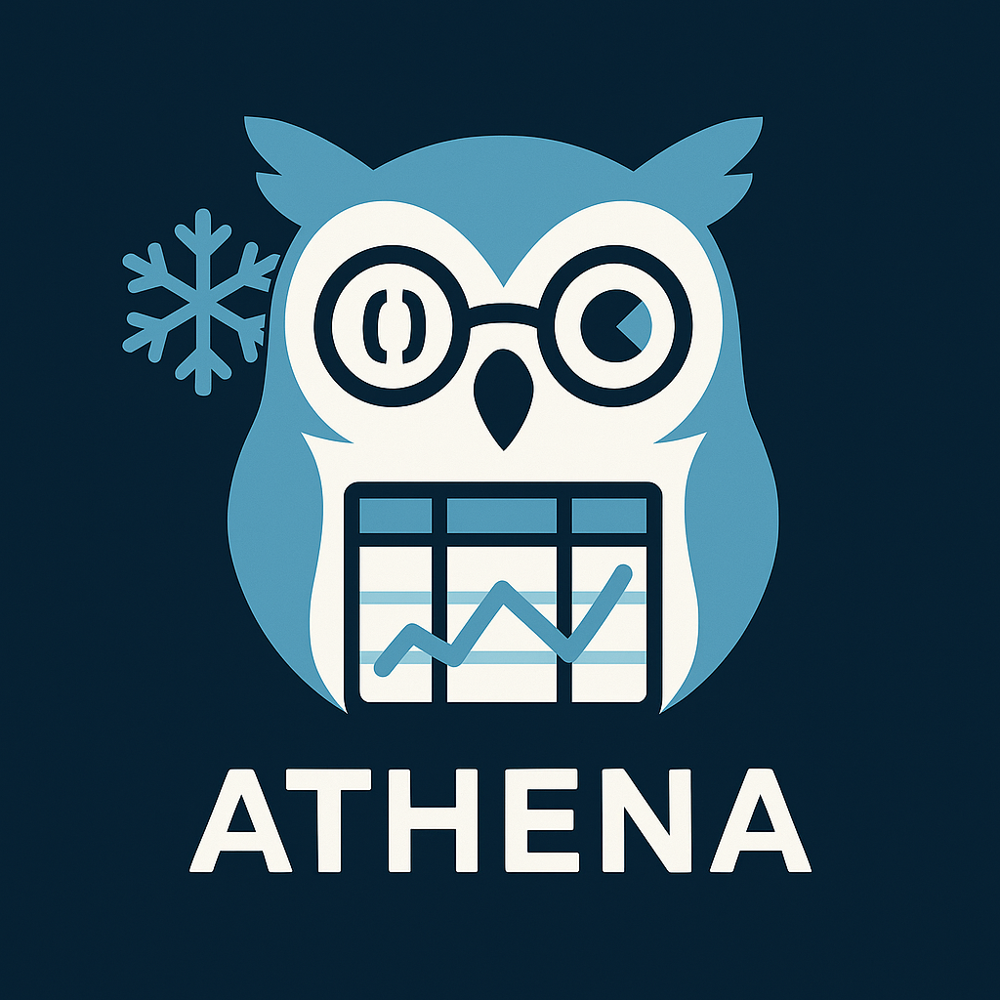

  

<h1 align="center">ATHENA</h1>

<b>Automated Transformations Highlighted and Explained Nicely and Accurately</b>

  
  
  
  

---

**ATHENA** is an open-source tool designed to break down and visualize the logic behind Polars DataFrame manipulations in Python code. 

---

## 🚀 What does ATHENA do?
ATHENA takes Python code that uses [Polars](https://www.pola.rs/) for DataFrame manipulation and:

1. **Breaks down** the code into individual Polars steps.
2. **Generates example DataFrames** that fit the logic of the code.
3. **Applies each step one at a time**, visualizing the result after each transformation using markdown tables.

This helps you:
- Sanity check complex Polars pipelines
- Demonstrate and explain code for teaching or documentation
- Visualize the effect of each transformation

---

## 🏷️ Tags
`polars` &nbsp; `dataframe` &nbsp; `visualization` &nbsp; `python` &nbsp; `open-source` &nbsp; `education` &nbsp; `explainability`

---

## ⚠️ Disclaimer
This is a passion project, developed and maintained in spare time. There is **no guarantee of long-term maintenance or support**. Contributions and feedback are welcome, but please use at your own risk.

---

## 📄 License
ATHENA is released under the [MIT License](LICENSE).
